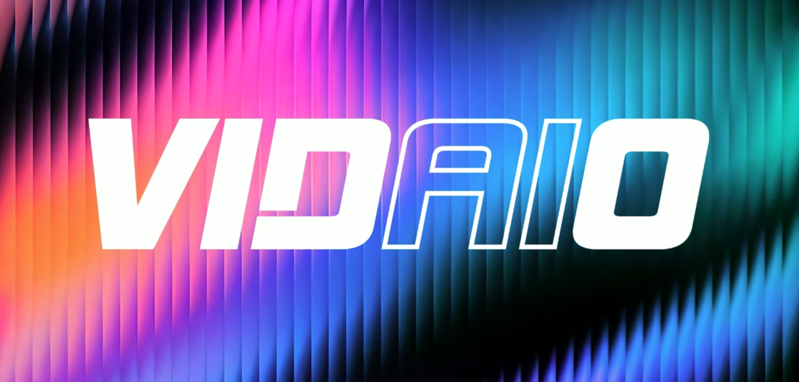

<div align="center">

# Vidaio Subnet

### Decentralized AI Infrastructure for Intelligent Video Processing

**AI-powered video enhancement, compression, transcoding, and streaming — built on Bittensor.**

[](https://vidaio.io)
[](https://x.com/vidaio_)
[](https://opensource.org/licenses/MIT)

[](https://vidaio.io)

[Website](https://vidaio.io) • [X / Twitter](https://x.com/vidaio_) • [Validator Setup](docs/validator_setup.md) • [Miner Setup](docs/miner_setup.md)

</div>

---

## Table of Contents

* [1. Introduction](#1-introduction)
* [2. Subnet Architecture](#2-subnet-architecture)

  * [2.1 Overview](#21-overview)
  * [2.2 Miners](#22-miners)
  * [2.3 Validators](#23-validators)
  * [2.4 Synapses](#24-synapses)

    * [2.4.1 Synthetic Queries](#241-synthetic-queries)
    * [2.4.2 Organic Queries](#242-organic-queries)
  * [2.5 Incentive Mechanism](#25-incentive-mechanism)
* [3. Setup](#3-setup)
* [4. Roadmap](#4-roadmap)
* [5. Appendix](#5-appendix)

  * [A. Technical Glossary](#a-technical-glossary)
  * [B. References](#b-references)
  * [C. Contact](#c-contact)

---

# 1. Introduction

**Vidaio Subnet** is a decentralized AI-powered video processing network built on the **Bittensor ecosystem**.

Our mission is to make advanced video processing more accessible, scalable, and cost-efficient by combining **artificial intelligence, decentralized compute, and blockchain-based incentives**.

Vidaio enables creators, developers, businesses, and platforms to process video through an open network of competing miners while maintaining ownership and control over their content.

The subnet initially focuses on two core workloads:

* **AI Video Upscaling** — enhance resolution and perceived visual quality.
* **Intelligent Video Compression** — reduce file size and bandwidth requirements while preserving visual quality.

Over time, Vidaio aims to evolve into a broader decentralized video infrastructure layer supporting **transcoding, adaptive bitrate optimization, on-demand streaming, live streaming, and API-driven video processing**.

---

# 2. Subnet Architecture

## 2.1 Overview

Vidaio follows Bittensor's decentralized miner-validator architecture.

At a high level:

```text
                         Vidaio Subnet

      ┌─────────────────────────────────────────────┐
      │                                             │
      │              User / Application             │
      │                                             │
      └──────────────────────┬──────────────────────┘
                             │
                             ▼
                    ┌─────────────────┐
                    │   Validators    │
                    │                 │
                    │ • Route tasks   │
                    │ • Benchmark     │
                    │ • Score miners  │
                    └────────┬────────┘
                             │
                ┌────────────┼────────────┐
                │            │            │
                ▼            ▼            ▼
          ┌──────────┐ ┌──────────┐ ┌──────────┐
          │ Miner A  │ │ Miner B  │ │ Miner N  │
          │          │ │          │ │          │
          │ Upscale  │ │ Compress │ │ Process  │
          └──────────┘ └──────────┘ └──────────┘
                │            │            │
                └────────────┼────────────┘
                             │
                             ▼
                    Quality Evaluation
                             │
                             ▼
                  Incentives & Rankings
```

### Miners

Miners perform computational video-processing workloads and compete to produce the best results.

### Validators

Validators distribute workloads, evaluate miner responses, calculate performance scores, and help maintain the quality and integrity of the subnet.

---

## 2.2 Miners

Miners are the execution layer of the Vidaio network.

They process video workloads submitted by validators and continuously compete on **quality, efficiency, and processing performance**.

Miners can:

* Optimize existing open-source video-processing models.
* Develop proprietary AI models and processing pipelines.
* Process AI-powered video upscaling requests.
* Perform intelligent video compression.
* Optimize inference and encoding performance.
* Balance visual quality, latency, compute usage, and output size.
* Respond to both synthetic benchmark tasks and real-world user requests.

Vidaio intentionally allows miners to innovate independently rather than enforcing a single processing implementation.

This competitive environment encourages miners to continuously improve their models, infrastructure, and processing strategies.

---

## 2.3 Validators

Validators are responsible for maintaining the quality and reliability of the subnet.

They interact with miners by issuing processing requests and evaluating the resulting outputs.

Validator responsibilities include:

* Generating synthetic benchmark workloads.
* Routing organic user requests.
* Evaluating miner outputs.
* Measuring video quality and processing efficiency.
* Tracking miner performance over time.
* Assigning scores and weights.
* Helping distribute subnet incentives toward high-performing miners.

Validators evaluate both **upscaling** and **compression** workflows to ensure miners consistently deliver useful results under real-world conditions.

---

## 2.4 Synapses

Vidaio uses synapses to define communication and processing workflows between validators and miners.

The subnet currently supports two major query categories:

1. **Synthetic queries** — controlled workloads used for benchmarking.
2. **Organic queries** — real-world workloads originating from users or applications.

---

### 2.4.1 Synthetic Queries

Synthetic queries allow validators to benchmark miners using controlled inputs where output quality can be evaluated consistently.

#### Video Upscaling

A validator starts with a high-resolution reference video.

```text
High-Resolution Reference
          │
          ▼
      Downscale
          │
          ▼
Low-Resolution Input
          │
          ▼
        Miner
          │
          ▼
 AI Upscaled Output
          │
          ▼
Compare Against Reference
```

The workflow:

1. A high-resolution source video is selected.
2. The validator downscales the video.
3. The degraded version is sent to miners.
4. Miners reconstruct or upscale the video.
5. The miner output is compared against the original reference.
6. Quality metrics contribute to the miner's score.

This allows validators to objectively measure how effectively miners restore visual detail.

#### Video Compression

For compression workloads:

1. Validators select high-quality source videos.
2. Videos are sent to miners with compression requirements.
3. Miners encode and optimize the video.
4. Validators evaluate visual quality and resulting file size.
5. Miners are ranked according to the quality-to-compression tradeoff.

The objective is not simply to generate the smallest file.

Miners must preserve visual quality while minimizing storage and bandwidth requirements.

### Quality Evaluation

Processed videos can be evaluated using perceptual and objective quality metrics, including:

* **VMAF** — Video Multi-Method Assessment Fusion.
* **PieAPP** — perceptual image-error assessment.
* **TOPIQ** — top-down image quality assessment.
* **LPIPS** — learned perceptual image patch similarity.

These metrics help validators compare miner outputs using consistent quality signals.

---

### 2.4.2 Organic Queries

Organic queries represent real-world workloads submitted by users, applications, or services.

A typical processing workflow is:

```text
User Upload
    │
    ▼
Video Preparation
    │
    ▼
Chunking / Task Queue
    │
    ▼
Validator Routing
    │
    ▼
Selected Miners
    │
    ▼
AI Video Processing
    │
    ▼
Result Aggregation
    │
    ▼
Final Video
    │
    ▼
User / Application
```

The process includes:

1. A video-processing request enters the network.
2. Large videos may be divided into smaller processing chunks.
3. Tasks are queued and distributed to miners.
4. Miners perform the requested operation.
5. Outputs are validated and aggregated.
6. The final processed video is returned to the requesting application or user.

Organic workloads may request:

* Video upscaling.
* Video compression.
* Different quality profiles.
* Different output resolutions.
* Future transcoding or streaming workflows.

---

## 2.5 Incentive Mechanism

Vidaio rewards miners according to the usefulness and quality of the video-processing services they provide.

Miner performance can consider factors such as:

* Visual quality.
* Compression efficiency.
* Processing latency.
* Reliability.
* Successful request completion.
* Quality consistency.
* Resource efficiency.

For the detailed scoring and reward methodology, see:

**[Incentive Mechanism Guide →](docs/incentive_mechanism.md)**

---

# 3. Setup

Interested in participating in the Vidaio subnet?

### Run a Validator

Validators evaluate miners, submit workloads, and contribute to maintaining subnet quality.

**[Validator Setup Guide →](docs/validator_setup.md)**

### Run a Miner

Miners provide video-processing compute and compete based on the quality and efficiency of their results.

**[Miner Setup Guide →](docs/miner_setup.md)**

---

# 4. Roadmap

Vidaio's roadmap expands the subnet from AI video enhancement into a comprehensive decentralized video-processing and streaming infrastructure.

## Phase 1 — Video Processing Synapses

**Foundation**

* Launch AI-powered video upscaling.
* Launch intelligent video compression.
* Establish synthetic benchmarking workflows.
* Support organic video-processing requests.
* Evaluate miners based on quality and processing performance.

---

## Phase 2 — Advanced Video Processing Models

**Optimization**

* Introduce advanced AI-powered compression models.
* Explore intelligent bitrate optimization.
* Improve video quality at lower bandwidth levels.
* Optimize processing speed and compute efficiency.
* Support increasingly diverse video formats and workloads.

---

## Phase 3 — Transcode Optimization Synapse

**Compatibility**

Introduce decentralized transcoding workflows for efficient video delivery across different devices and platforms.

The subnet will evaluate miners across:

* Processing speed.
* Output quality.
* Codec efficiency.
* File size.
* Device compatibility.
* Compute efficiency.

---

## Phase 4 — On-Demand Streaming Architecture

**Decentralized Delivery**

Expand Vidaio into an on-demand video-processing and delivery network.

Planned capabilities include:

* Decentralized video storage integration.
* Distributed processing.
* Peer-to-peer delivery mechanisms.
* Redundancy across participating nodes.
* High-availability content delivery.
* Intelligent video preparation for streaming.

---

## Phase 5 — Live Streaming Through the Subnet

**Real-Time Processing**

Enable real-time video workflows through decentralized infrastructure.

Planned functionality includes:

* Live video transcoding.
* Real-time AI upscaling.
* Real-time compression.
* Adaptive bitrate generation.
* Stream-quality optimization.
* Distributed processing for live workloads.

---

## Phase 6 — Vidaio Subnet API

**Real-World Integration**

Expose Vidaio's decentralized video-processing capabilities through a developer-friendly API.

Planned API capabilities include:

```text
Upload → Configure → Process → Monitor → Retrieve
```

Developers will be able to:

* Upload videos.
* Select processing operations.
* Configure output quality.
* Submit asynchronous processing jobs.
* Monitor processing status.
* Retrieve generated outputs.
* Integrate decentralized video processing into external applications.

The API will make Vidaio accessible to applications without requiring developers to directly interact with the underlying subnet infrastructure.

---

# 5. Appendix

## A. Technical Glossary

| Technology                     | Description                                                                                |
| ------------------------------ | ------------------------------------------------------------------------------------------ |
| **Bittensor**                  | Decentralized network and incentive framework for machine intelligence                     |
| **Subnet**                     | Specialized network within the Bittensor ecosystem                                         |
| **Miner**                      | Node that performs AI or computational workloads                                           |
| **Validator**                  | Node that evaluates miners and assigns performance weights                                 |
| **Synapse**                    | Request/response protocol used for communication between validators and miners             |
| **VMAF**                       | Video Multi-Method Assessment Fusion for perceptual video-quality evaluation               |
| **PieAPP**                     | Perceptual image-error evaluation metric                                                   |
| **TOPIQ**                      | Top-down image quality assessment methodology                                              |
| **LPIPS**                      | Learned Perceptual Image Patch Similarity metric                                           |
| **Video2X**                    | Video and image upscaling framework                                                        |
| **Transcoding**                | Conversion of video between codecs, formats, resolutions, or bitrates                      |
| **Adaptive Bitrate Streaming** | Streaming approach that dynamically changes video quality according to available bandwidth |

---

## B. References

### Video Quality & Processing


### Bittensor

* **Bittensor Documentation** — [docs.bittensor.com](https://docs.bittensor.com)

---

## C. Contact

Want to learn more, contribute, or follow Vidaio's development?

* **Website:** [vidaio.io](https://vidaio.io)
* **X / Twitter:** [@vidaio_](https://x.com/vidaio_)
* **GitHub:** Vidaio Subnet repositories and documentation

---

<div align="center">

### Building decentralized infrastructure for the future of intelligent video.

**[Website](https://vidaio.io) • [X](https://x.com/vidaio_) • [Miner Setup](docs/miner_setup.md) • [Validator Setup](docs/validator_setup.md)**

<br>

MIT Licensed

</div>
